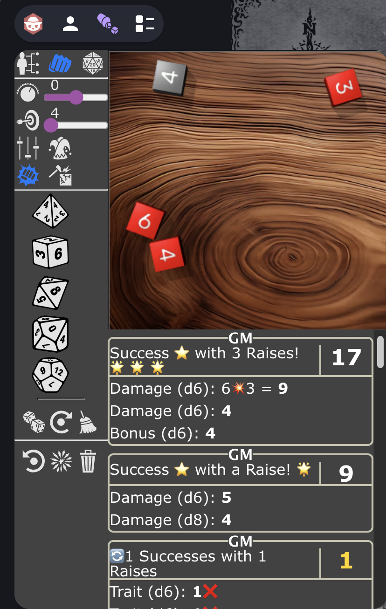
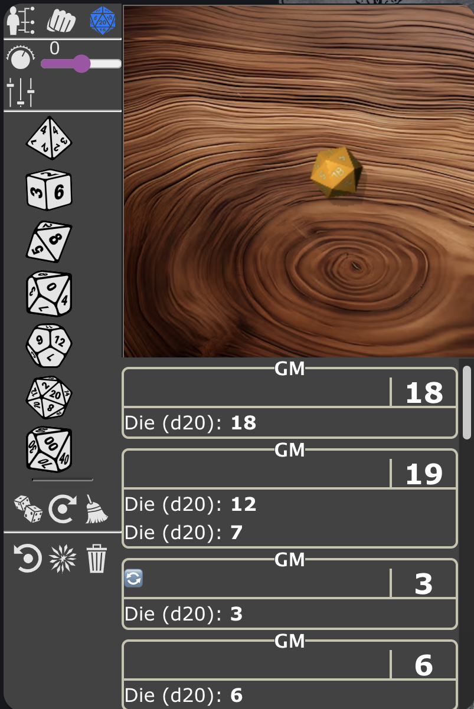

# Savage Owlbear Dice

A custom 3D dice roller extension for Savage Worlds Adventure Edition (SWADE) fans using Owlbear Rodeo. This extension simulates the unique dice mechanics of SWADE, including exploding dice (acing), wild dice, success/raise calculations, and more.

## How It Works

The extension provides a physics-based 3D dice simulation. Select dice by clicking the die icons (d4 through d100), set modifiers and options, then click the Roll button to simulate the roll. Results are calculated according to SWADE rules and displayed in the dice history log.

The extension supports three roll modes: Trait Rolls, Damage Rolls, and Standard Rolls. Each mode has specific controls and behaviors tailored to SWADE mechanics.

## Roll Modes

### 1. Trait Rolls

Used for skill checks, attacks, spellcasting, and other trait-based rolls. Trait rolls determine success based on meeting or exceeding a Target Number (TN), with possible raises.

**Controls:**
- **Target Number**:  Spinner (4-24, default 4) - The number to beat for success.
- **Modifier**:  Spinner (-14 to +14, default 0) - Bonus/penalty applied to the roll.
- **Wild Die**:  Toggle to enable/disable the wild die (d6 by default, selectable type).
- **Wild Die Type**:  Dropdown to select wild die size (d6, d8, d10, d12).
- **Opposed Roll**:  Toggle to set Target Number to the result of the most recent trait roll by another player.
- **Joker Drawn**:  Toggle (+2 modifier) when a Joker is drawn from the Action Deck.
- **Wounds**:  Three toggles (-1 each) for wound penalties.
- **Fatigue**:  Two toggles (-1 each) for fatigue penalties.
- **Dice Selection**:  d4, d6, d8, d10, d12 - Click to add trait dice to the tray.

**Mechanics:**
- For single trait die: Roll trait die + wild die (if enabled), use higher result, check against TN for success/raises.
- For multiple trait dice: Each die that meets/exceeds TN counts as a success. Wild die can add successes/raises.
- Exploding dice: Dice "ace" (roll max) and add another die.
- Critical failure: If multiple trait dice and more than half show 1s, including wild die as 1.

**Example:** Fighting attack with d8 trait, wild die d6, TN 4, +1 modifier.
- Roll: Trait d8=6, Wild d6=4 → Use 6, success with 1 raise (6-4=2, 2/4=0.5→1 raise).

### 2. Damage Rolls

Used for calculating damage from weapons, spells, etc. Damage rolls sum all dice, with modifiers applied.

**Controls:**
- **Target Number**:  Spinner (4-24) - Optional, used to calculate raises on damage.
- **Modifier**:  Spinner (-14 to +14, default 0) - Bonus/penalty to damage.
- **Bonus Damage**:  Toggle to add an extra d6 for bonus damage effects.
- **Breaking Objects**:  Toggle to disable acing (dice don't explode on max roll).
- **Joker Drawn**:  Toggle (+2 modifier) when Joker drawn.
- **Dice Selection**:  d4, d6, d8, d10, d12 - Click to add damage dice.

**Mechanics:**
- Sum all dice + modifiers.
- Exploding dice unless "Breaking Objects" is enabled.
- If TN set, calculate raises: (damage - TN) / 4, rounded down.

**Example:** Damage with 2d6, +1 modifier, TN 4.
- Roll: 4 + 3 +1 = 8, success with 1 raise (8-4=4, 4/4=1).

### 3. Standard Rolls

Basic dice rolls without SWADE-specific mechanics. Simply sums dice with modifiers.

**Controls:**
- **Modifier**:  Spinner (-14 to +14, default 0).
- **Dice Selection**:  d4 through d100 - All available dice types.

**Mechanics:**
- Sum all dice + modifier.
- No exploding, no TN checks.

**Example:** 3d6 +2 modifier = roll 2+5+1 +2 = 10.

## General Controls

- **Roll Dice**:  Executes the roll with current settings.
- **Reroll Dice**:  Re-rolls the most recent roll by the same player.
- **Remove Dice**:  Clears all dice from the tray.
- **Reset**:  Resets all controls to defaults.
- **Adjust**:  After a roll, modify TN/modifiers and recalculate results.
- **Color**:  Cycles through dice color themes.
- **Clear**:  Clears the entire dice history log.

## Dice History Log

The log displays past rolls with the following information:
- **Player Name**: Who made the roll.
- **Roll Details**: Breakdown of each die, modifiers, and calculations.
- **Result**: Total and description (success/failure, raises, etc.).
- **Emojis** indicate special outcomes:
  - ⭐ Success
  - ❌ Failure
  - 🌟 Raise (additional success level)
  - 💥 Ace (die exploded and added another)
  - 💀 Critical Failure
  - 🃏 Joker bonus applied
  - 🎚 Roll adjusted after the fact
  - 🔄 Reroll of previous roll
  - 🩹 Wound/fatigue penalty applied

The log persists across sessions and syncs across players in the Owlbear Rodeo room.

## Examples

**Trait Roll Example:**
- Mode: Trait
- Dice: 1d8 (trait), Wild Die d6 enabled
- TN: 5 (opponent's Parry)
- Modifier: +1 (from edge)
- Wounds: 1 (-1 penalty)
- Result: Trait 8 (aces to 3) + Wild 4 = 8 total, success with 1 raise.

**Damage Roll Example:**
- Mode: Damage
- Dice: 2d6
- Bonus Damage: Enabled (+1d6)
- Modifier: +2 (strength)
- Breaking Objects: Disabled
- Result: 5 + 4 + 6 (aces to 2) +2 = 13 damage.

**Standard Roll Example:**
- Mode: Standard
- Dice: 1d20
- Modifier: +5
- Result: 17 +5 = 22.

## Support

For issues or questions, please contact the developer or check the Owlbear Rodeo community forums.

