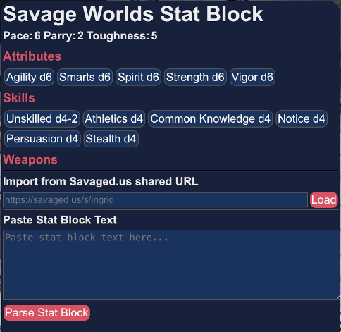
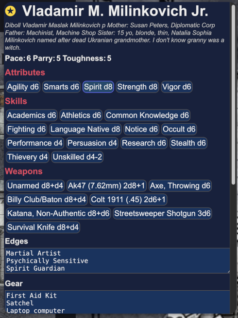

## Savage Owlbear Dice

A custom 3D dice roller extension for Savage Worlds Adventure Edition (SWADE) fans using [Owlbear Rodeo](https://owlbear-rodeo.com/). This extension simulates the unique dice mechanics of SWADE, including exploding dice (acing), wild dice, success/raise calculations, and more.

## Overview

This extension implements the Savage Worlds Dice Rolling system. This extension supports many of the unique dice mechanics and rules of Savage Worlds with Wild Dice, Aceing(exploding dice), success/raise calculation, critical failures, and more, making it simple to set modifiers for wounds, fatigue, bonus damage, having a joker, breaking things.

## Getting Started

### Installation

1. Install the extension from the manifest at <https://swdrob.vercel.app/manifest.json>
2. Open your Owlbear Rodeo scene
3. Click the Savage Owlbear Dice icon  in the toolbar to open the dice tray

## How It Works

The extension provides a physics-based 3D dice simulation. Select dice by clicking the die icons (d4 through d100), set modifiers and options, then click the Roll button to simulate the roll. Results are calculated according to SWADE rules and displayed in the dice history log.

The extension supports three roll modes: Trait Rolls, Damage Rolls, and Standard Rolls. Each mode has specific controls and behaviors tailored to SWADE mechanics.

## Roll Modes

### 1. Trait Rolls

Used for skill checks, attacks, spellcasting, and other trait-based rolls. Trait rolls determine success based on meeting or exceeding a Target Number (TN), with possible raises.

**Controls:**

- **Target Number**:  Spinner (4-24, default 4) - The number to meet or beat for success.
- **Modifier**:  Spinner (-14 to +14, default 0) - Bonus/penalty applied to the roll.
- **Wild Die**:  Toggle to enable/disable the wild die (d6 by default, selectable type).
- **Wild Die Type**:  Dropdown to select wild die size (d6, d8, d10, d12).
- **Adjust**:  After a roll, updates results of the latest roll in history log according to changed target number and modifiers.
- **Joker Drawn**:  Toggle (+2 modifier) when your character gets Joker from the Action Deck.
- **Opposed Roll**:  Toggle to set Target Number to the result of the most recent trait roll by another player.
- **Wounds**:  Three toggles (-1 each) for wound penalties.
- **Fatigue**:  Two toggles (-1 each) for fatigue penalties.
- **Distracted**:  Toggle to set Distracted status for trait rolls.
- **Wild Attack**:  Toggle to make a Wild Attack roll(-2, +2 damage).
- **The Drop**:  Toggle to indicate having The Drop on the Foe.
- **Vulnerable**:  Toggle to set when Foe is Vulnerable to attack rolls.
- **Multi-Action**:  Cycles through One Action, Two Actions(-2), and Three Actions(-4) multi-action penalties.
- **Gang Up**:  Cycles through Gang Up Bonuses +1 to +4.
- **Called Shot**:  Cycles through various called shot locations, Limb(-2), Hand(-4), Head/Vitals(-4,+4 dmg), Item(-2), Item(-4), Unarmored(-4), Eyeslit(-6).
- **Cover**:  Cycles through No Cover, Light Cover(-2), Medium Cover(-4), Heavy Cover(-6), and Near Total Cover(-8).
- **Range**:  Cycles through Short Range, Medium Range(-2), Long Range(-4) and Extreme Range(-8).
- **Illumination**:  Cycles through Light, Dim(-2), Dark(-4), and Pitch(-6).

- **Dice Selection**:  d4, d6, d8, d10, d12 - Click to add trait dice to the tray.

**Mechanics:**

- For single trait die: Roll trait die + wild die (if enabled), use higher result, check against TN for success/raises.
- For multiple trait dice: Each die that meets/exceeds TN counts as a success. Wild die can add successes/raises.
- Exploding dice: Dice "ace" (roll max) and add another die.
- Critical failure: If multiple trait dice and more than half show 1s, including wild die as 1.

**Example:** Fighting attack with d8 trait, wild die d6, TN 4, +1 modifier.

- Roll: Trait d8=6, Wild d6=4 → Use 6, success with 1 raise (6-4=2, 2/4=0.5→1 raise).

### 2. Damage Rolls

Used for calculating damage from weapons, spells, etc. Damage rolls sum all dice, with modifiers applied.

**Controls:**

- **Target Number**:  Spinner (4-24) - Optional, used to calculate raises on damage.
- **Modifier**:  Spinner (-14 to +14, default 0) - Bonus/penalty to damage.
- **Adjust**:  After a roll, updates results of the latest roll in history log according to changed target number and modifiers.
- **Joker Drawn**:  Toggle (+2 modifier) when dealt a Joker.
- **Breaking Objects**:  Toggle to disable acing (dice don't explode on max roll) and bonus damge die.
- **Bonus Damage**:  Toggle to add an extra d6 for bonus damage effects.
- **Wild Attack**:  Toggle to make a Wild Attack roll(-2, +2 damage).
- **The Drop**:  Toggle to indicate having The Drop on the Foe.
- **Called Shot**:  Cycles through various called shot locations, Limb(-2), Hand(-4), Head/Vitals(-4,+4 dmg), Item(-2), Item(-4), Unarmored(-4), Eyeslit(-6). Only affects damage rolls when Head/Vitals.

- **Dice Selection**:  d4, d6, d8, d10, d12 - Click to add damage dice.

**Mechanics:**

- Sum all dice + modifiers.
- Exploding dice unless "Breaking Objects" is enabled.
- If TN set, calculate raises: (damage - TN) / 4, rounded down.

**Example:** Damage with 2d6, +1 modifier, TN 4.

- Roll: 4 + 3 +1 = 8, success with 1 raise (8-4=4, 4/4=1).

### 3. Standard Rolls

Basic dice rolls without SWADE-specific mechanics. Simply sums dice with modifiers.

**Controls:**

- **Modifier**:  Spinner (-14 to +14, default 0).
- **Adjust**:  After a roll, updates results of the latest roll in history log according to changed target number and modifiers.

- **Dice Selection**:  d4 through d100 - All available dice types.

**Mechanics:**

- Sum all dice + modifier.
- No exploding, no TN checks.

**Example:** 3d6 +2 modifier = roll 2+5+1 +2 = 10.

## General Controls

- **Roll Dice**:  Executes the roll with current settings.
- **Reroll Dice**:  Re-rolls the most recent roll by the same player.
- **Remove Dice**:  Clears all dice from the tray.
- **Reset**:  Resets all controls to defaults.
- **Color**:  Cycles through dice color themes.
- **Clear**:  Clears the entire dice history log.

## Dice History Log

The log displays past rolls with the following information:

- **Player Name**: Who made the roll.
- **Roll Details**: Breakdown of each die, modifiers, and calculations.
- **Result**: Total and description (success/failure, raises, etc.).
- **Emojis** indicate special outcomes:
  - ⭐ Success
  - ❌ Failure
  - 🌟 Raise (additional success level)
  - 💥 Ace (die exploded and added another)
  - 💀 Critical Failure
  - 🃏 Joker bonus applied
  - 🎚 Roll adjusted after the fact
  - 🔄 Reroll of previous roll
  - 🩸 Wound/fatigue penalty applied

The log persists across sessions and syncs across players in the Owlbear Rodeo room.

## Examples

**Trait Roll Example:**

- Mode: Trait
- Dice: 1d8 (trait), Wild Die d6 enabled
- TN: 5 (opponent's Parry)
- Modifier: +1 (from edge)
- Wounds: 1 (-1 penalty)
- Result: Trait 8 (aces to 3) + Wild 4 = 8 total, success with 1 raise.

**Damage Roll Example:**

- Mode: Damage
- Dice: 2d6
- Bonus Damage: Enabled (+1d6)
- Modifier: +2 (strength)
- Breaking Objects: Disabled
- Result: 5 + 4 + 6 (aces to 2) +2 = 13 damage.

**Standard Roll Example:**

- Mode: Standard
- Dice: 1d20
- Modifier: +5
- Result: 17 +5 = 22.

## Savage Worlds Stat Block Features

The Savage Worlds Stat Block system is a web-based interface for managing and interacting with character data in the Savage Worlds tabletop RPG system. It provides a comprehensive UI for displaying character attributes, skills, weapons, powers, and other game mechanics. Character data can be imported from shared characters from Savaged.us, or by copy/paste of Savage Worlds stat blocks from PDFs, documents or online resources.

### Core Components

#### Stat Block Popup

The interface is organized into several key sections:

1. **Character Header**: Displays the character name with a wildcard symbol indicator
2. **Basic Stats**: Shows Pace, Parry, and Toughness values
3. **Attributes Section**: Lists core character attributes (Agility, Smarts, Spirit, Strength, Vigor)
4. **Skills Section**: Displays character skills with roll buttons
5. **Weapons Section**: Shows available weapons with damage rolls
6. **Powers Section**: Lists magical/arcane powers with casting options
7. **Edges/Gear/Special Abilities/Edges/Hindrances**: Text areas for additional character details
8. **Advances Section**: Tracks character progression
9. **Import Functionality**: URL import and text parsing for stat blocks

### Using the Stat Block

In Owlbear Rodeo with the extension loaded, add a character avatar to the scene. You will only be able to attach to characters that you own.

- Right Click on the character image. (Can also be accessed by left click, then the three dots.)
- Select  from the context menu.
- A popup window will appear with a default character.

- At the botton of the window are 2 input boxes, one for interfacing with Savaged.us, if you have a shared character there, and one for pasting the stat block text directly.
- Enter the url to the shared character and click Load.
- Alternatively, copy/paste the stat block text into the text area, and click the Parse Stat Block button to have your pasted text parsed by the extention.
- The character data will be extracted and displayed in the popup window.

*** The parser will try to capture everything it can, however, different sources format and organize Savage World stat blocks slightly differently and this can confuse the parser. If it doesn't extract everything from the text, you can try reviewing and edit the text to help it out. Might work, might not.

### Data Management

#### Data Persistence

- Stores character data in Owlbear Rodeo item metadata
- Implements caching with 24-hour expiration
- Supports automatic refresh from source URLs when data is stale

### Roll Mechanics

#### Roll Types

- **Trait Rolls**: For attributes and skills
- **Damage Rolls**: For weapons and damage powers
- **Special Rolls**: Frenzy, ROF (Rate of Fire) calculations

#### ROF (Rate of Fire) Handling

- Automatically detects weapons with ROF > 1
- Creates ROF buttons from 2 up to maximum weapon ROF
- Applies -2 penalty unless character has "Rock and Roll" edge
- Supports Rapid Fire feats for +1 ROF

#### Frenzy Support

- Detects characters with Frenzy edge
- Creates special Frenzy button for Fighting skill
- Rolls 2 dice of the fighting skill type

### Import Functionality

#### URL Import

- Parses character data from Savaged.us shared URLs
- Stores original URL for future refreshes
- Handles errors gracefully with fallback to cached data

#### Text Parsing

- Accepts pasted stat block text
- Uses `Savaged.parseCharacterFromText()` for parsing
- Stores both parsed character and original text

#### Special Calculations

- Toughness display includes armor value when applicable
- ROF calculations consider character edges
- Power buttons differentiate between damage powers and regular spells

### Key Features Summary

1. **Comprehensive Character Display**: Savage Worlds character attributes and abilities
2. **Interactive Roll System**: Click-to-roll for skills, attributes, and weapons
3. **Advanced Combat Features**: ROF handling, Frenzy support, damage calculations
4. **Data Import**: URL and text-based stat block importing
5. **Smart UI**: Conditional display, dynamic sizing, and responsive layout
6. **Persistence**: Automatic saving and caching of character data
7. **Game Mechanics Support**: Handles core Savage Worlds rules and edges

The system provides a digital representation of Savage Worlds characters with support for the game's unique mechanics like wildcard characters, arcane powers, and combat edges.

## Acknowledgements

This extension is inspired by and built upon the mechanics of the Savage Worlds RPG system. Special thanks to:

- **Savage Worlds Adventure Edition** by [Pinnacle Entertainment Group](https://www.peginc.com/) for the core RPG system and dice mechanics.
- **@3d-dice/dice-box** library from [Fantastic Dice](https://fantasticdice.games/) for providing the 3D dice simulation engine.
- **Savage Dice Roller** by immaterialplane (<https://immaterialplane.com/apps/swdr/>) for the original concept and implementation that inspired this Owlbear Rodeo extension.
- **Game Icons** from <https://game-icons.net/> for the icon assets used in the interface.
- **Savaged.us** <https://savaged.us> for the excellent Savage Worlds character builder.

## Support

For issues or questions, please contact the developer or check the Owlbear Rodeo community forums.
