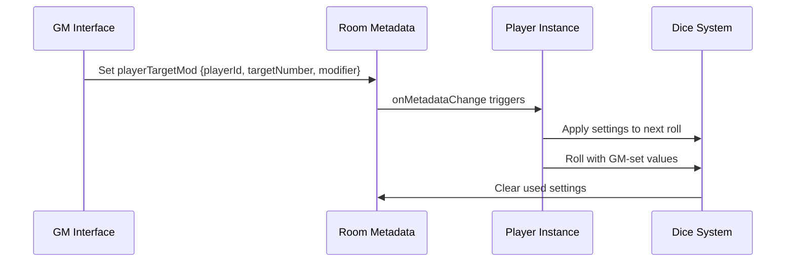

# To-Do List

- improvements and bug fixes
  - [complete] handle Smarts d6 (A) and Smarts d4 (M)
  - [complete] remove em or en dash or hyphen from Gear, Edges, Powers, string
  - handle ligatures in input parsing text, some pdfs have ligatures ex. tt in Attribute:
  - [complete] handle arcane background in edges list ex. Arcane Background (Weird Science),

- Environment
  - [complete] Add illumination toggles for light, dim, dark, and pitch +0 Light: normal illumination  −2 Dim: Twilight, light fog, night with a full moon. −4 Dark: Typical night conditions with some ambient light from stars, a clouded or partial moon, emergency lights in an office building, a few flickering torches in a large space, etc. Targets aren't visible outside of 10″. −6 Pitch: Complete and total darkness (or the target is hidden or invisible). Powers that require sight may not be possible.
  
- Attacker conditions
  - [complete] -2 distracted: -2 to all trait, trait mode only
  - -2 unstable platform, -2 to ranged (not melee), trait mode only
  - -2 prone: -2 fighting(melee)

- Attacher options
  - [complete] +2 wild attack: +2 to melee (not ranged), +2 to damage (on both trait and damage mode)
  - [complete] -2/-4 multi-actions: -2 for 2 actions, -4 for 3 actions, limit 3
  - [complete] -2/-4 0 calledshot, -2 limb, -4 hand, -4 head(+4 dmg), -2 itemsword, -4 itempistol, -4 unarmored, -6 eyeslit
  - **-2 offhand: -2 on attack

- Target conditions
  - [complete] -2/-4/-6/-8 cover: -2 light, -4 medium, -6 heavy, -8 near total
  - [complete] +2 vulnerable: target is vulnerable
  - [complete] +4 drop: attacker has the drop on target
  - [complete] 0/-2/-4/-8: range penalties, short medium long extreme
  - +2 unarmed defender and armed attacker, melee only; does not stack with the drop
  - [use-medium-cover]-4 prone: range attack target is prone, -4 medium cover if >= 3" away; melee, +0 but target gets -2 parry; is this needed or just rely on -4 medium cover?
  - [complete]+1-4 gang up: based on adjacent characters

- Allow GM to set a particular player's target number and modifier values(modifier, illumination, cover, range, vulnerable, prone target)

## GM Target/Modifier Setting Feature Design

### Feature Overview

This feature would allow GMs to:

1. Select a player from the current game session
2. Set a specific target number for that player's next roll
3. Set a specific modifier for that player's next roll
4. Send this configuration to the player's instance
5. Have the settings automatically apply when the player makes their next roll

### Implementation Approach

The extension already has the foundation needed through the existing metadata system. Here's how it would work:



### Code Implementation

#### 1. Add GM Interface Controls

```typescript
// Add to main.ts - GM Controls Section
function setupGMControls() {
    // Only show if player is GM
    if (playerCache.isGm) {
        const gmControls = document.createElement('div');
        gmControls.id = 'gm-controls';
        gmControls.innerHTML = `
            <div class="gm-target-setting">
                <select id="player-select">
                    <option value="">Select Player</option>
                </select>
                <input type="number" id="gm-target-number" min="4" max="24" value="4" placeholder="Target">
                <input type="number" id="gm-modifier" min="-14" max="14" value="0" placeholder="Mod">
                <button id="gm-set-values">Set Values</button>
            </div>
        `;
        document.querySelector('.controls')?.appendChild(gmControls);

        // Populate player dropdown
        updatePlayerDropdown();

        // Set up event listener
        document.getElementById('gm-set-values')?.addEventListener('click', async () => {
            const playerId = (document.getElementById('player-select') as HTMLSelectElement).value;
            const targetNumber = parseInt((document.getElementById('gm-target-number') as HTMLInputElement).value);
            const modifier = parseInt((document.getElementById('gm-modifier') as HTMLInputElement).value);

            if (playerId) {
                await setPlayerTargetMod(playerId, targetNumber, modifier);
            }
        });
    }
}
```

#### 2. Player Dropdown Management

```typescript
// Add to main.ts
async function updatePlayerDropdown() {
    const playerSelect = document.getElementById('player-select') as HTMLSelectElement;
    if (!playerSelect) return;

    // Get all players in the current room
    const players = await OBR.room.getPlayers();
    playerSelect.innerHTML = '<option value="">Select Player</option>';

    players.forEach(player => {
        if (player.id !== playerCache.id) { // Don't include self
            const option = document.createElement('option');
            option.value = player.id;
            option.textContent = player.name;
            playerSelect.appendChild(option);
        }
    });
}
```

#### 3. Metadata Setting Function

```typescript
// Add to main.ts
async function setPlayerTargetMod(playerId: string, targetNumber: number, modifier: number) {
    try {
        // Create the metadata object
        const metadata = {
            playerTargetMod: {
                [playerId]: {
                    targetNumber: targetNumber,
                    modifier: modifier,
                    timestamp: Date.now(),
                    used: false
                }
            }
        };

        // Set the metadata
        await OBR.room.setMetadata(metadata);
        Debug.log(`GM set target ${targetNumber} and modifier ${modifier} for player ${playerId}`);

        // Clear after 5 minutes if not used
        setTimeout(async () => {
            const currentMetadata = await OBR.room.getMetadata();
            if (currentMetadata?.playerTargetMod?.[playerId]?.used !== true) {
                await clearPlayerTargetMod(playerId);
            }
        }, 300000); // 5 minutes

    } catch (error) {
        console.error("Failed to set player target/modifier:", error);
    }
}
```

#### 4. Metadata Handling Extension

```typescript
// Extend onRoomMetadataChange in main.ts
async function onRoomMetadataChange(metadata: any) {
    // Existing code...

    // Add player target/modifier handling
    if (metadata.playerTargetMod) {
        try {
            const playerId = playerCache.id;
            const playerSettings = metadata.playerTargetMod[playerId];

            if (playerSettings && !playerSettings.used) {
                // Store these values for the next roll
                window.gmSetTargetNumber = playerSettings.targetNumber;
                window.gmSetModifier = playerSettings.modifier;

                // Mark as used to prevent reapplication
                await markTargetModAsUsed(playerId);

                // Show notification to player
                showGMNotification(playerSettings);
            }
        } catch (error) {
            console.error("Failed to process player target/modifier:", error);
        }
    }
}
```

#### 5. Apply Settings Before Roll

```typescript
// Modify rollTheDice function to check for GM settings
async function rollTheDice() {
    if (!isDiceToRoll()) return;
    RollCollection = new SWDR();

    // Check for GM-set values
    if (window.gmSetTargetNumber !== undefined) {
        setSpinner(targetNumberSpinner, targetCurrent, window.gmSetTargetNumber.toString());
        window.gmSetTargetNumber = undefined; // Clear after use
    }

    if (window.gmSetModifier !== undefined) {
        setSpinner(modifierSpinner, modifierCurrent, window.gmSetModifier.toString());
        window.gmSetModifier = undefined; // Clear after use
    }

    // Rest of existing roll logic...
    DB.isReroll = false;
    DB.targetNumber = getTargetNumber();
    DB.rollType = getRollType();
    // ... etc
}
```

#### 6. Helper Functions

```typescript
// Add helper functions
async function markTargetModAsUsed(playerId: string) {
    const metadata = await OBR.room.getMetadata();
    if (metadata?.playerTargetMod?.[playerId]) {
        metadata.playerTargetMod[playerId].used = true;
        await OBR.room.setMetadata(metadata);
    }
}

async function clearPlayerTargetMod(playerId: string) {
    const metadata = await OBR.room.getMetadata();
    if (metadata?.playerTargetMod?.[playerId]) {
        delete metadata.playerTargetMod[playerId];
        await OBR.room.setMetadata(metadata);
    }
}

function showGMNotification(settings: {targetNumber: number, modifier: number}) {
    const notification = document.createElement('div');
    notification.className = 'gm-notification';
    notification.textContent = `GM set: Target ${settings.targetNumber}, Modifier ${settings.modifier > 0 ? '+' : ''}${settings.modifier}`;
    document.body.appendChild(notification);

    setTimeout(() => {
        notification.remove();
    }, 5000);
}
```

#### 7. CSS Additions

```css
/* Add to styles.css */
.gm-controls {
    background-color: #2a2a2a;
    padding: 10px;
    border-radius: 5px;
    margin-bottom: 10px;
    display: flex;
    gap: 8px;
    align-items: center;
}

.gm-target-setting {
    display: flex;
    gap: 8px;
    align-items: center;
}

.gm-notification {
    position: fixed;
    bottom: 20px;
    right: 20px;
    background-color: #3a3a3a;
    color: white;
    padding: 10px 15px;
    border-radius: 5px;
    z-index: 1000;
    animation: fadeInOut 5s ease-in-out;
}

@keyframes fadeInOut {
    0% { opacity: 0; transform: translateY(20px); }
    10% { opacity: 1; transform: translateY(0); }
    90% { opacity: 1; transform: translateY(0); }
    100% { opacity: 0; transform: translateY(20px); }
}
```

## Feature Benefits

1. **Enhanced GM Control**: GMs can set specific challenges for players
2. **Opposed Roll Support**: Easy to set target numbers for opposed rolls
3. **Environmental Effects**: Apply penalties/bonuses for terrain, lighting, etc.
4. **Dynamic Difficulty**: Adjust challenge levels on-the-fly
5. **Player-Specific**: Target individual players without affecting others
6. **Temporary**: Settings apply only to the next roll then clear

## Implementation Notes

- **Security**: Only GMs can set these values through the interface
- **Temporary**: Values automatically clear after use or timeout
- **Notification**: Players are informed when GM sets values
- **Compatibility**: Works with existing roll system
- **Cleanup**: Automatic cleanup prevents stale data

This feature would significantly enhance the GM's ability to control game flow and create dynamic challenges while maintaining the existing user experience.
