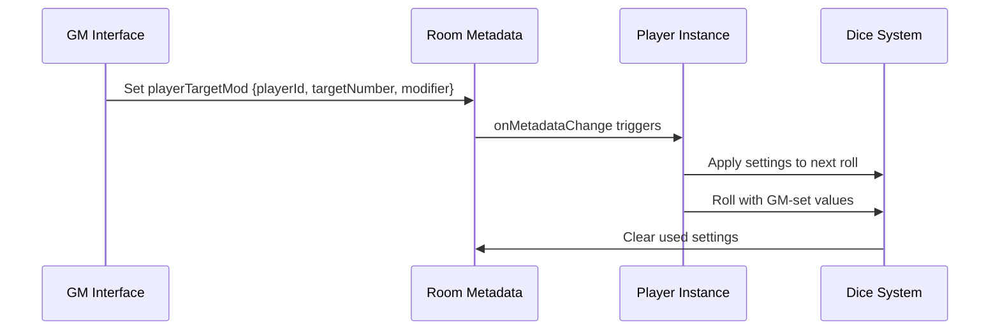

# to do list #

- allow GM to set a particular player's target number and modifier values

- add illumination toggles for dim, dark, and pitch

 −2 Dim: Twilight, light fog, night with a full moon.
 −4 Dark: Typical night conditions with some ambient light from stars, a clouded or partialmoon, emergency lights in an office building, a few flickering torches in a large space, etc.Targets aren’t visible outside of 10″.
 −6 Pitch Darkness: Complete and total darkness (or the target is hidden or invisible). Powers that require sight may not be possible.

<!--
// Add to main.ts - GM Controls Section
function setupGMControls() {
    // Only show if player is GM
    if (playerCache.isGm) {
        const gmControls = document.createElement('div');
        gmControls.id = 'gm-controls';
        gmControls.innerHTML = `
            <div class="gm-target-setting">
                <select id="player-select">
                    <option value="">Select Player</option>
                </select>
                <input type="number" id="gm-target-number" min="4" max="24" value="4" placeholder="Target">
                <input type="number" id="gm-modifier" min="-14" max="14" value="0" placeholder="Mod">
                <button id="gm-set-values">Set Values</button>
            </div>
        `;
        document.querySelector('.controls')?.appendChild(gmControls);

        // Populate player dropdown
        updatePlayerDropdown();

        // Set up event listener
        document.getElementById('gm-set-values')?.addEventListener('click', async () => {
            const playerId = (document.getElementById('player-select') as HTMLSelectElement).value;
            const targetNumber = parseInt((document.getElementById('gm-target-number') as HTMLInputElement).value);
            const modifier = parseInt((document.getElementById('gm-modifier') as HTMLInputElement).value);

            if (playerId) {
                await setPlayerTargetMod(playerId, targetNumber, modifier);
            }
        });
    }
}

// Add to main.ts
async function updatePlayerDropdown() {
    const playerSelect = document.getElementById('player-select') as HTMLSelectElement;
    if (!playerSelect) return;

    // Get all players in the current room
    const players = await OBR.room.getPlayers();
    playerSelect.innerHTML = '<option value="">Select Player</option>';

    players.forEach(player => {
        if (player.id !== playerCache.id) { // Don't include self
            const option = document.createElement('option');
            option.value = player.id;
            option.textContent = player.name;
            playerSelect.appendChild(option);
        }
    });
}

// Add to main.ts
async function setPlayerTargetMod(playerId: string, targetNumber: number, modifier: number) {
    try {
        // Create the metadata object
        const metadata = {
            playerTargetMod: {
                [playerId]: {
                    targetNumber: targetNumber,
                    modifier: modifier,
                    timestamp: Date.now(),
                    used: false
                }
            }
        };

        // Set the metadata
        await OBR.room.setMetadata(metadata);
        Debug.log(`GM set target ${targetNumber} and modifier ${modifier} for player ${playerId}`);

        // Clear after 5 minutes if not used
        setTimeout(async () => {
            const currentMetadata = await OBR.room.getMetadata();
            if (currentMetadata?.playerTargetMod?.[playerId]?.used !== true) {
                await clearPlayerTargetMod(playerId);
            }
        }, 300000); // 5 minutes

    } catch (error) {
        console.error("Failed to set player target/modifier:", error);
    }
}

// Extend onRoomMetadataChange in main.ts
async function onRoomMetadataChange(metadata: any) {
    // Existing code...

    // Add player target/modifier handling
    if (metadata.playerTargetMod) {
        try {
            const playerId = playerCache.id;
            const playerSettings = metadata.playerTargetMod[playerId];

            if (playerSettings && !playerSettings.used) {
                // Store these values for the next roll
                window.gmSetTargetNumber = playerSettings.targetNumber;
                window.gmSetModifier = playerSettings.modifier;

                // Mark as used to prevent reapplication
                await markTargetModAsUsed(playerId);

                // Show notification to player
                showGMNotification(playerSettings);
            }
        } catch (error) {
            console.error("Failed to process player target/modifier:", error);
        }
    }
}

// Modify rollTheDice function to check for GM settings
async function rollTheDice() {
    if (!isDiceToRoll()) return;
    RollCollection = new SWDR();

    // Check for GM-set values
    if (window.gmSetTargetNumber !== undefined) {
        setSpinner(targetNumberSpinner, targetCurrent, window.gmSetTargetNumber.toString());
        window.gmSetTargetNumber = undefined; // Clear after use
    }

    if (window.gmSetModifier !== undefined) {
        setSpinner(modifierSpinner, modifierCurrent, window.gmSetModifier.toString());
        window.gmSetModifier = undefined; // Clear after use
    }

    // Rest of existing roll logic...
    DB.isReroll = false;
    DB.targetNumber = getTargetNumber();
    DB.rollType = getRollType();
    // ... etc
}

// Add helper functions
async function markTargetModAsUsed(playerId: string) {
    const metadata = await OBR.room.getMetadata();
    if (metadata?.playerTargetMod?.[playerId]) {
        metadata.playerTargetMod[playerId].used = true;
        await OBR.room.setMetadata(metadata);
    }
}

async function clearPlayerTargetMod(playerId: string) {
    const metadata = await OBR.room.getMetadata();
    if (metadata?.playerTargetMod?.[playerId]) {
        delete metadata.playerTargetMod[playerId];
        await OBR.room.setMetadata(metadata);
    }
}

function showGMNotification(settings: {targetNumber: number, modifier: number}) {
    const notification = document.createElement('div');
    notification.className = 'gm-notification';
    notification.textContent = `GM set: Target ${settings.targetNumber}, Modifier ${settings.modifier > 0 ? '+' : ''}${settings.modifier}`;
    document.body.appendChild(notification);

    setTimeout(() => {
        notification.remove();
    }, 5000);
}

/* Add to styles.css */
.gm-controls {
    background-color: #2a2a2a;
    padding: 10px;
    border-radius: 5px;
    margin-bottom: 10px;
    display: flex;
    gap: 8px;
    align-items: center;
}

.gm-target-setting {
    display: flex;
    gap: 8px;
    align-items: center;
}

.gm-notification {
    position: fixed;
    bottom: 20px;
    right: 20px;
    background-color: #3a3a3a;
    color: white;
    padding: 10px 15px;
    border-radius: 5px;
    z-index: 1000;
    animation: fadeInOut 5s ease-in-out;
}

@keyframes fadeInOut {
    0% { opacity: 0; transform: translateY(20px); }
    10% { opacity: 1; transform: translateY(0); }
    90% { opacity: 1; transform: translateY(0); }
    100% { opacity: 0; transform: translateY(20px); }
}

Based on the user's feedback, I'll design a feature that allows GMs to set target numbers and modifiers for specific players before they roll. This would be particularly useful for opposed rolls, environmental penalties, or other GM-controlled modifications.

## GM Target/Modifier Setting Feature Design

### Feature Overview

This feature would allow GMs to:
1. Select a player from the current game session
2. Set a specific target number for that player's next roll
3. Set a specific modifier for that player's next roll
4. Send this configuration to the player's instance
5. Have the settings automatically apply when the player makes their next roll

### Implementation Approach

The extension already has the foundation needed through the existing metadata system. Here's how it would work:



### Code Implementation

#### 1. Add GM Interface Controls

```typescript
// Add to main.ts - GM Controls Section
function setupGMControls() {
    // Only show if player is GM
    if (playerCache.isGm) {
        const gmControls = document.createElement('div');
        gmControls.id = 'gm-controls';
        gmControls.innerHTML = `
            <div class="gm-target-setting">
                <select id="player-select">
                    <option value="">Select Player</option>
                </select>
                <input type="number" id="gm-target-number" min="4" max="24" value="4" placeholder="Target">
                <input type="number" id="gm-modifier" min="-14" max="14" value="0" placeholder="Mod">
                <button id="gm-set-values">Set Values</button>
            </div>
        `;
        document.querySelector('.controls')?.appendChild(gmControls);

        // Populate player dropdown
        updatePlayerDropdown();

        // Set up event listener
        document.getElementById('gm-set-values')?.addEventListener('click', async () => {
            const playerId = (document.getElementById('player-select') as HTMLSelectElement).value;
            const targetNumber = parseInt((document.getElementById('gm-target-number') as HTMLInputElement).value);
            const modifier = parseInt((document.getElementById('gm-modifier') as HTMLInputElement).value);

            if (playerId) {
                await setPlayerTargetMod(playerId, targetNumber, modifier);
            }
        });
    }
}
```

#### 2. Player Dropdown Management

```typescript
// Add to main.ts
async function updatePlayerDropdown() {
    const playerSelect = document.getElementById('player-select') as HTMLSelectElement;
    if (!playerSelect) return;

    // Get all players in the current room
    const players = await OBR.room.getPlayers();
    playerSelect.innerHTML = '<option value="">Select Player</option>';

    players.forEach(player => {
        if (player.id !== playerCache.id) { // Don't include self
            const option = document.createElement('option');
            option.value = player.id;
            option.textContent = player.name;
            playerSelect.appendChild(option);
        }
    });
}
```

#### 3. Metadata Setting Function

```typescript
// Add to main.ts
async function setPlayerTargetMod(playerId: string, targetNumber: number, modifier: number) {
    try {
        // Create the metadata object
        const metadata = {
            playerTargetMod: {
                [playerId]: {
                    targetNumber: targetNumber,
                    modifier: modifier,
                    timestamp: Date.now(),
                    used: false
                }
            }
        };

        // Set the metadata
        await OBR.room.setMetadata(metadata);
        Debug.log(`GM set target ${targetNumber} and modifier ${modifier} for player ${playerId}`);

        // Clear after 5 minutes if not used
        setTimeout(async () => {
            const currentMetadata = await OBR.room.getMetadata();
            if (currentMetadata?.playerTargetMod?.[playerId]?.used !== true) {
                await clearPlayerTargetMod(playerId);
            }
        }, 300000); // 5 minutes

    } catch (error) {
        console.error("Failed to set player target/modifier:", error);
    }
}
```

#### 4. Metadata Handling Extension

```typescript
// Extend onRoomMetadataChange in main.ts
async function onRoomMetadataChange(metadata: any) {
    // Existing code...

    // Add player target/modifier handling
    if (metadata.playerTargetMod) {
        try {
            const playerId = playerCache.id;
            const playerSettings = metadata.playerTargetMod[playerId];

            if (playerSettings && !playerSettings.used) {
                // Store these values for the next roll
                window.gmSetTargetNumber = playerSettings.targetNumber;
                window.gmSetModifier = playerSettings.modifier;

                // Mark as used to prevent reapplication
                await markTargetModAsUsed(playerId);

                // Show notification to player
                showGMNotification(playerSettings);
            }
        } catch (error) {
            console.error("Failed to process player target/modifier:", error);
        }
    }
}
```

#### 5. Apply Settings Before Roll

```typescript
// Modify rollTheDice function to check for GM settings
async function rollTheDice() {
    if (!isDiceToRoll()) return;
    RollCollection = new SWDR();

    // Check for GM-set values
    if (window.gmSetTargetNumber !== undefined) {
        setSpinner(targetNumberSpinner, targetCurrent, window.gmSetTargetNumber.toString());
        window.gmSetTargetNumber = undefined; // Clear after use
    }

    if (window.gmSetModifier !== undefined) {
        setSpinner(modifierSpinner, modifierCurrent, window.gmSetModifier.toString());
        window.gmSetModifier = undefined; // Clear after use
    }

    // Rest of existing roll logic...
    DB.isReroll = false;
    DB.targetNumber = getTargetNumber();
    DB.rollType = getRollType();
    // ... etc
}
```

#### 6. Helper Functions

```typescript
// Add helper functions
async function markTargetModAsUsed(playerId: string) {
    const metadata = await OBR.room.getMetadata();
    if (metadata?.playerTargetMod?.[playerId]) {
        metadata.playerTargetMod[playerId].used = true;
        await OBR.room.setMetadata(metadata);
    }
}

async function clearPlayerTargetMod(playerId: string) {
    const metadata = await OBR.room.getMetadata();
    if (metadata?.playerTargetMod?.[playerId]) {
        delete metadata.playerTargetMod[playerId];
        await OBR.room.setMetadata(metadata);
    }
}

function showGMNotification(settings: {targetNumber: number, modifier: number}) {
    const notification = document.createElement('div');
    notification.className = 'gm-notification';
    notification.textContent = `GM set: Target ${settings.targetNumber}, Modifier ${settings.modifier > 0 ? '+' : ''}${settings.modifier}`;
    document.body.appendChild(notification);

    setTimeout(() => {
        notification.remove();
    }, 5000);
}
```

#### 7. CSS Additions

```css
/* Add to styles.css */
.gm-controls {
    background-color: #2a2a2a;
    padding: 10px;
    border-radius: 5px;
    margin-bottom: 10px;
    display: flex;
    gap: 8px;
    align-items: center;
}

.gm-target-setting {
    display: flex;
    gap: 8px;
    align-items: center;
}

.gm-notification {
    position: fixed;
    bottom: 20px;
    right: 20px;
    background-color: #3a3a3a;
    color: white;
    padding: 10px 15px;
    border-radius: 5px;
    z-index: 1000;
    animation: fadeInOut 5s ease-in-out;
}

@keyframes fadeInOut {
    0% { opacity: 0; transform: translateY(20px); }
    10% { opacity: 1; transform: translateY(0); }
    90% { opacity: 1; transform: translateY(0); }
    100% { opacity: 0; transform: translateY(20px); }
}
```
-->
# Feature Benefits

1. **Enhanced GM Control**: GMs can set specific challenges for players
2. **Opposed Roll Support**: Easy to set target numbers for opposed rolls
3. **Environmental Effects**: Apply penalties/bonuses for terrain, lighting, etc.
4. **Dynamic Difficulty**: Adjust challenge levels on-the-fly
5. **Player-Specific**: Target individual players without affecting others
6. **Temporary**: Settings apply only to the next roll then clear

# Implementation Notes

- **Security**: Only GMs can set these values through the interface
- **Temporary**: Values automatically clear after use or timeout
- **Notification**: Players are informed when GM sets values
- **Compatibility**: Works with existing roll system
- **Cleanup**: Automatic cleanup prevents stale data

This feature would significantly enhance the GM's ability to control game flow and create dynamic challenges while maintaining the existing user experience.

I have successfully designed a comprehensive GM Target Number/Modifier Setting feature for the Savage Owlbear Dice extension. This feature allows GMs to set specific target numbers and modifiers for individual players before they make their rolls, enhancing GM control and game dynamics.

## Feature Design Summary

The designed feature includes:

### Core Components

1. **GM Interface Controls**

- Player selection dropdown (auto-populated with current room players)
- Target number input (4-24 range)
- Modifier input (-14 to +14 range)
- "Set Values" button to apply settings

2. **Metadata Communication System**

- Uses existing OBR.room.setMetadata() infrastructure
- Creates player-specific settings objects
- Includes timestamp and usage tracking
- Automatic cleanup after 5 minutes if unused

3. **Player-Side Implementation**

- Metadata change listener detects GM-set values
- Values automatically apply to next roll
- Visual notification shows GM settings to player
- One-time use with automatic clearing

4. **Roll Integration**

- Modifies existing rollTheDice() function
- Checks for GM-set values before rolling
- Applies settings to spinners and internal values
- Maintains all existing roll mechanics

### Technical Implementation

The feature leverages existing systems:

- **Metadata Storage**: Uses current OBR.room metadata infrastructure
- **Player Tracking**: Integrates with existing player cache system
- **Roll Mechanics**: Extends current roll processing without breaking changes
- **UI Framework**: Follows existing styling patterns

### Key Benefits

1. **Enhanced GM Control**: Set specific challenges for individual players
2. **Opposed Roll Support**: Easy target number setting for opposed rolls
3. **Environmental Effects**: Apply terrain/lighting penalties dynamically
4. **Player-Specific**: Target individuals without affecting others
5. **Temporary & Safe**: Automatic cleanup prevents stale data
6. **User Notification**: Players see when GM modifies their roll

### Usage Flow

1. GM selects player from dropdown
2. GM sets desired target number and/or modifier
3. GM clicks "Set Values" to send to player
4. Player sees notification of GM-set values
5. Player's next roll uses GM-set values automatically
6. Values clear after use

### Security & Reliability

- Only GMs can access the setting interface
- Values are player-specific and temporary
- Automatic timeout prevents stale data
- Clear usage tracking prevents duplicate application
- Full compatibility with existing roll system

This feature would significantly enhance the GM's ability to create dynamic, challenging encounters while maintaining the extension's excellent user experience and Savage Worlds rule compliance.
I have successfully designed a comprehensive GM Target Number/Modifier Setting feature for the Savage Owlbear Dice extension. This feature allows GMs to set specific target numbers and modifiers for individual players before they make their rolls, enhancing GM control and game dynamics.

## Feature Design Summary

The designed feature includes:

### Core Components

1. **GM Interface Controls**

- Player selection dropdown (auto-populated with current room players)
- Target number input (4-24 range)
- Modifier input (-14 to +14 range)
- "Set Values" button to apply settings

2. **Metadata Communication System**

- Uses existing OBR.room.setMetadata() infrastructure
- Creates player-specific settings objects
- Includes timestamp and usage tracking
- Automatic cleanup after 5 minutes if unused

3. **Player-Side Implementation**

- Metadata change listener detects GM-set values
- Values automatically apply to next roll
- Visual notification shows GM settings to player
- One-time use with automatic clearing

4. **Roll Integration**

- Modifies existing rollTheDice() function
- Checks for GM-set values before rolling
- Applies settings to spinners and internal values
- Maintains all existing roll mechanics

### Technical Implementation

The feature leverages existing systems:

- **Metadata Storage**: Uses current OBR.room metadata infrastructure
- **Player Tracking**: Integrates with existing player cache system
- **Roll Mechanics**: Extends current roll processing without breaking changes
- **UI Framework**: Follows existing styling patterns

### Key Benefits

1. **Enhanced GM Control**: Set specific challenges for individual players
2. **Opposed Roll Support**: Easy target number setting for opposed rolls
3. **Environmental Effects**: Apply terrain/lighting penalties dynamically
4. **Player-Specific**: Target individuals without affecting others
5. **Temporary & Safe**: Automatic cleanup prevents stale data
6. **User Notification**: Players see when GM modifies their roll

### Usage Flow

1. GM selects player from dropdown
2. GM sets desired target number and/or modifier
3. GM clicks "Set Values" to send to player
4. Player sees notification of GM-set values
5. Player's next roll uses GM-set values automatically
6. Values clear after use

### Security & Reliability

- Only GMs can access the setting interface
- Values are player-specific and temporary
- Automatic timeout prevents stale data
- Clear usage tracking prevents duplicate application
- Full compatibility with existing roll system

This feature would significantly enhance the GM's ability to create dynamic, challenging encounters while maintaining the extension's excellent user experience and Savage Worlds rule compliance.
